# CodePath week 8 - Pentesting Live Targets.

Time spent: **9** hours.

> Objective: Identify vulnerabilities in three different versions of the Globitek website: blue, green, and red.

The six possible exploits are:
* Username Enumeration
* Insecure Direct Object Reference (IDOR)
* SQL Injection (SQLi)
* Cross-Site Scripting (XSS)
* Cross-Site Request Forgery (CSRF)
* Session Hijacking/Fixation

Each version of the site has been given two of the six vulnerabilities. (In other words, all six of the exploits should be assignable to one of the sites.)

## Pentesting Report

## Blue

Vulnerability #1: Session Hijacking/Fixation:  
* You log in to find the Session ID ussing the change_session_id script.
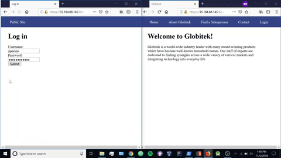
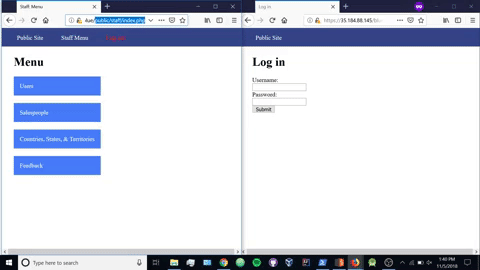
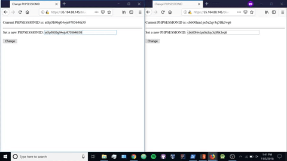
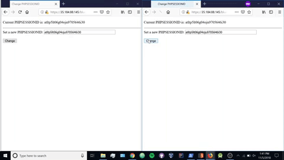

Vulnerability #2: SQL Injection (SQLi): 
* Check the url and find the id, replace the value with "2" . After include sleep(). Ex: " 2' and SLEEP(5)=0--' " 
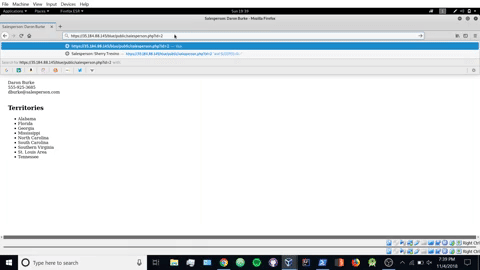
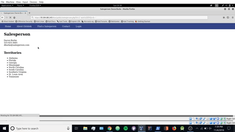

## Green

Vulnerability #1: 
* User Enumeration: When you log in with a valid username and fail to log in you get bolded error message, if you try to log in with an invalid username the bolded error gets unbolded.

Vulnerability #2: 
* Cross Site Scripting: In the contact tab, you can add a script when submitting a comment to the user. This allows the attacker to be spamm the users with pop ups. 

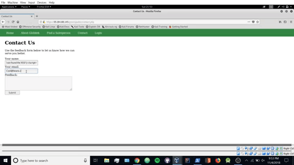
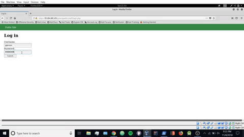

## Red

Vulnerability #1: Insecure Direct Object Reference (IDOR):
* THe ID of a person can be seen in the URL and can be changed to access the files of vissible and non vissible information.

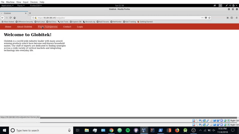

Vulnerability #2: Cross-Site Request Forgery (CSRF): 
* When using an html file ("coolbeans.html" in this github)  you can change the information of a person based on a specific web address. The attacker just needs to convince the user to open the file.

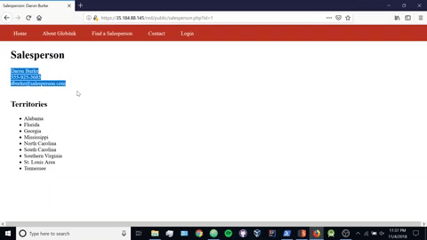
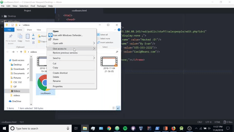

## Bonus: 
Green- XSS: 
* You can use the same technique as before to redirect the user to a different page. In this case i redirected the user to youtube, but it can be used to redirect the user to a malicious. 
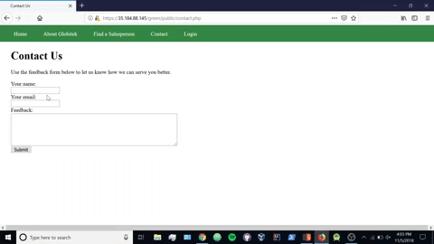
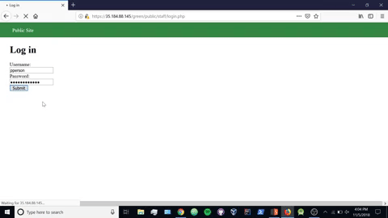
